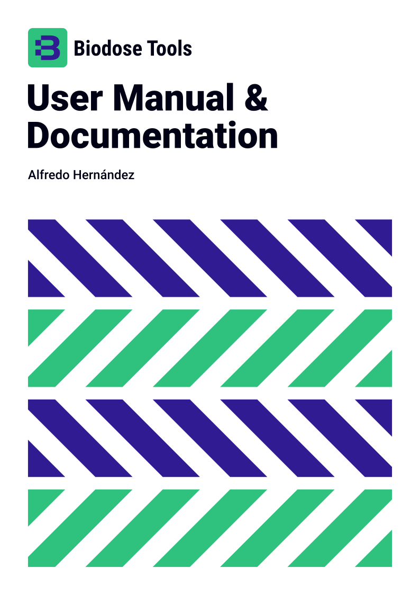

# Biodose Tools User Guide & Documentation

  

This project is an app to be used by biological dosimetry laboratories. Biodose Tools is an open source project that aims to be a tool to perform all different tests and calculations needed. The app is developed using the [R](https://www.r-project.org/about.html) programming language and [Shiny](https://shiny.rstudio.com) as a framework to offer an online, easy-to-use solution. Although the intention is to provide the application as a website, all R routines are available as an R package, which can be downloaded for improvement or personal use.

We also aim to clarify and explain the tests used and to propose those considered most appropriate. Each laboratory in its routine work should choose the optimum method, but the project aims to reach a consensus that will help us in case of mutual assistance or intercomparisons.

The project is initially developed by [RENEB](http://www.reneb.net) association, but contributions are always welcome.
